# Manual review: free-tier site alignment

The advisor ran this review on 2026-10-08 against branch `feat/72-free-tier-site-alignment`.

## Setup

1. The advisor copied the tracked files of the branch into a scratch directory, outside the main checkout.
2. In that directory, the advisor ran `npm run build`. The command exited with code 0.
3. In that directory, the advisor ran `npx next start -p 3100`.
4. The advisor opened each page with agent-browser at 1280x720 and at 414x896.
5. After the run, the advisor stopped the `next-server` process on port 3100. A request to port 3100 then failed to connect.

The build ran in a copy because `next build` and `next dev` share the `.next` directory in Next.js 14.2.4. A build in the main checkout breaks the dev server on port 3000.

The "before" screenshots show the live site at mifune.dev before this change. The "after" screenshots show the local production build.

## Overflow check

On each page and at each width, `document.documentElement.scrollWidth` was equal to `innerWidth`:

| Page | 1280x720 | 414x896 |
|---|---|---|
| `/` | `1280 <= 1280` | `414 <= 414` |
| `/pricing` | `1280 <= 1280` | `414 <= 414` |

## A. Home hero

1. Open `/`. Expected: the hero shows these three items:
   - the headline "A portable home for autonomous coding agents."
   - the primary button "Start your free workspace"
   - the line "Free for personal accounts · No card · No SSH key"

   | Before | After |
   |---|---|
   | 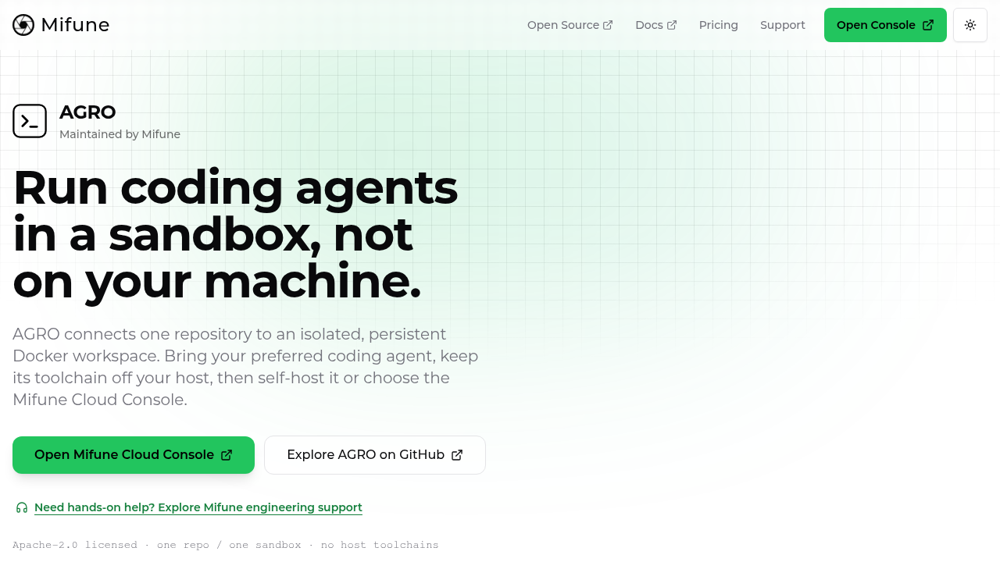 | 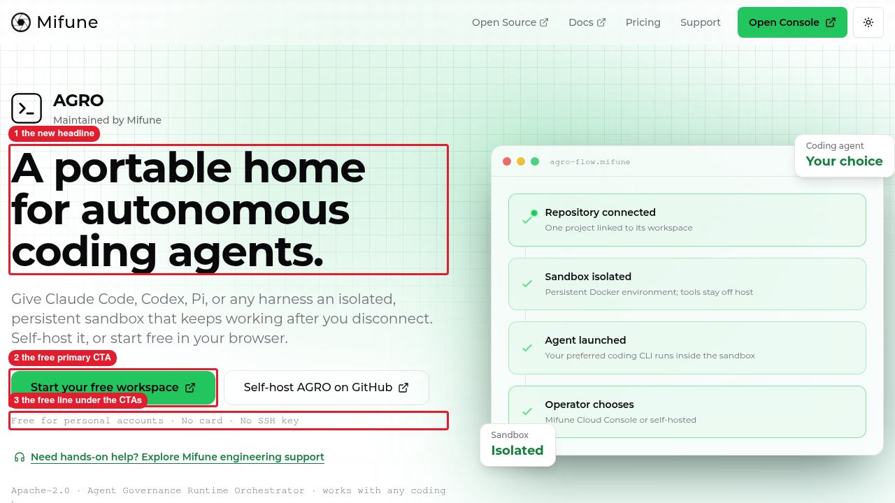 |
   | 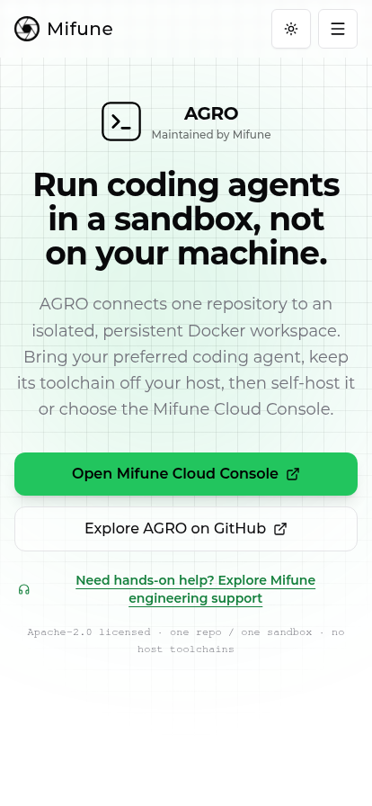 | 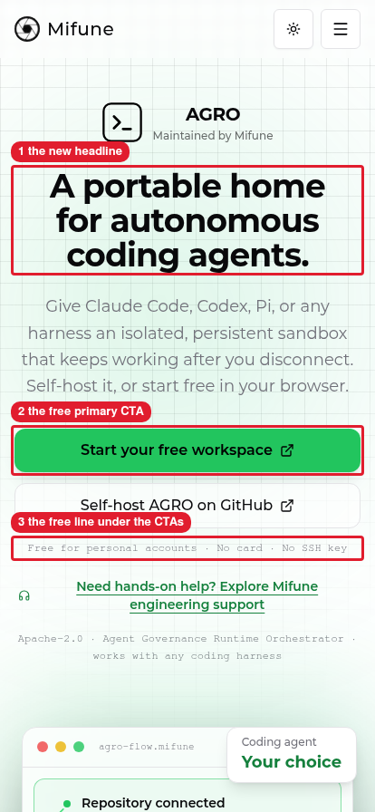 |

   Callouts: 1 is the new headline. 2 is the free primary CTA. 3 is the free line under the CTAs.

## B. Home Console card

1. On `/`, scroll to the Mifune Cloud Console card. Expected: the bullets "Free: 24 running hours a month on one n4 node" and "Browser terminal and editor, no SSH key".

   | Before | After |
   |---|---|
   | [Home before, desktop, full page](before/home-desktop-full.png) | 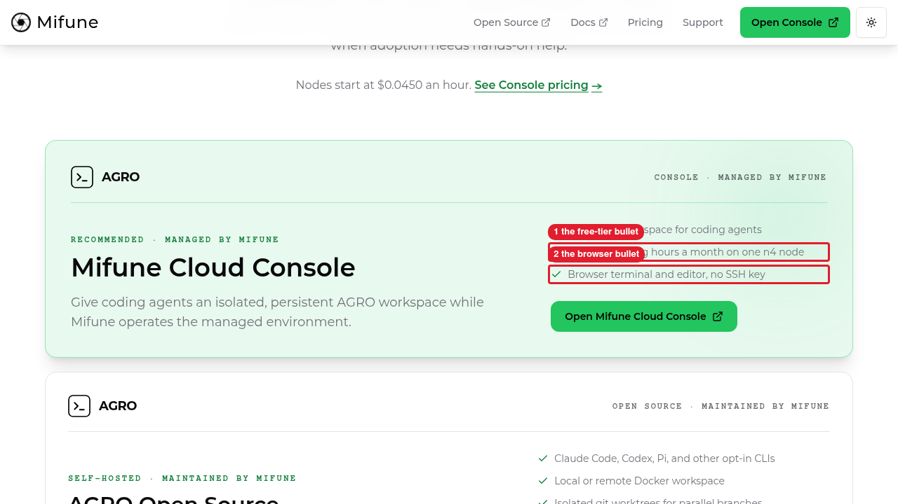 |
   | [Home before, mobile, full page](before/home-mobile-full.png) | 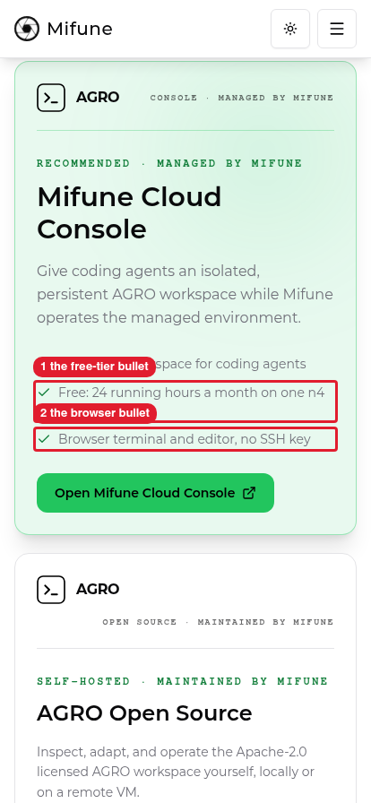 |

   Callouts: 1 is the free-tier bullet. 2 is the browser bullet.

## C. Pricing free card and CTA strip

1. Open `/pricing`. Expected: the page shows these three items:
   - the strip "Free for personal accounts: 24 running hours a month on one n4 node, no card · Limited free spots · Paid nodes need a card"
   - the card heading "Start your free workspace"
   - the button "Create free node"

   | Before | After |
   |---|---|
   | 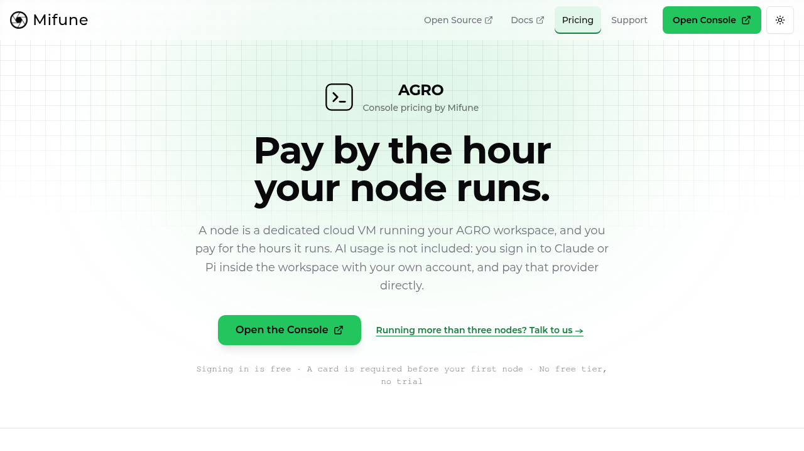 | 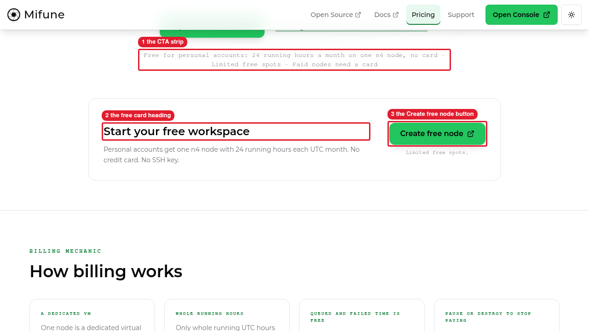 |
   | 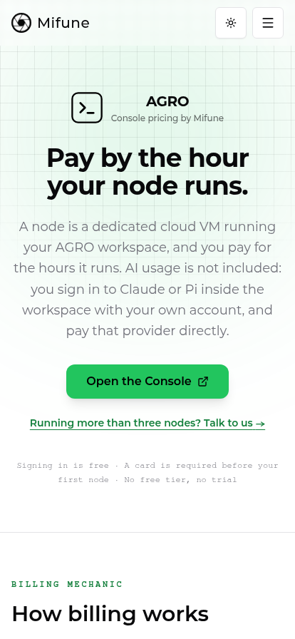 | 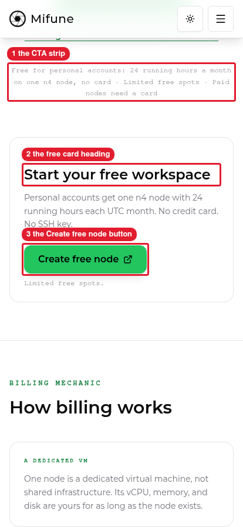 |

   Callouts: 1 is the CTA strip. 2 is the free card heading. 3 is the Create free node button.

## D. Pricing billing fact

1. On `/pricing`, scroll to "How billing works". Expected: the fact "Pause or destroy to stop paying" shows, with the detail `Only running time is billed. Pause a node to stop billing and keep its workspace. Destroy it to delete it for good.`

   | Before | After |
   |---|---|
   | [Pricing before, desktop, full page](before/pricing-desktop-full.png) | 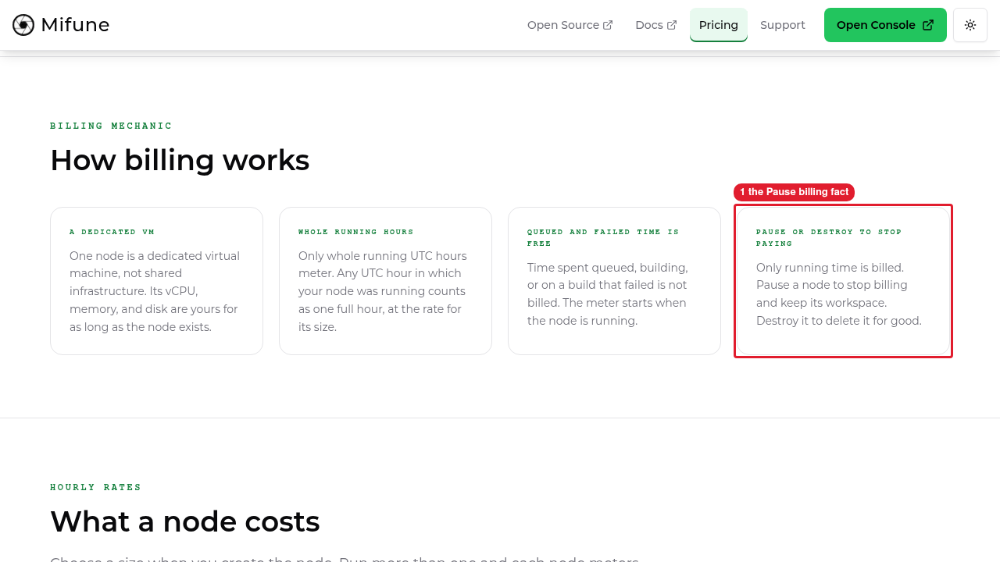 |
   | [Pricing before, mobile, full page](before/pricing-mobile-full.png) | 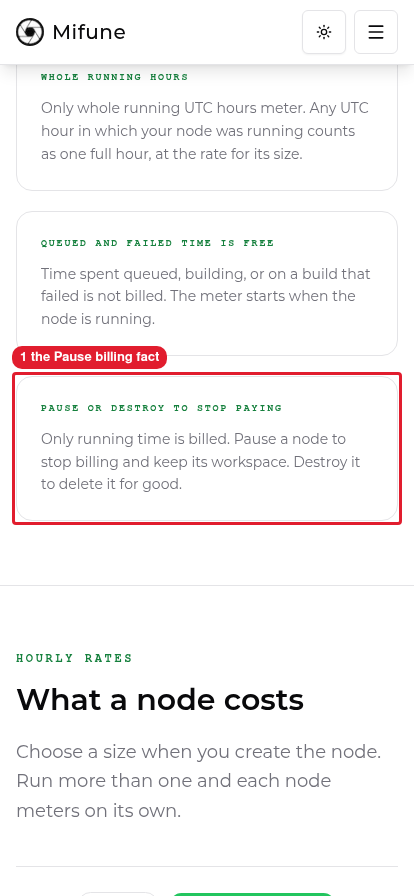 |

   Callouts: 1 is the Pause billing fact.

## E. Pricing rate calculator

1. On `/pricing`, scroll to "What a node costs". Expected: the 4 GB (n4) row shows the label "Free tier eligible". No other row shows the label.

   | Before | After |
   |---|---|
   | [Pricing before, desktop, full page](before/pricing-desktop-full.png) | 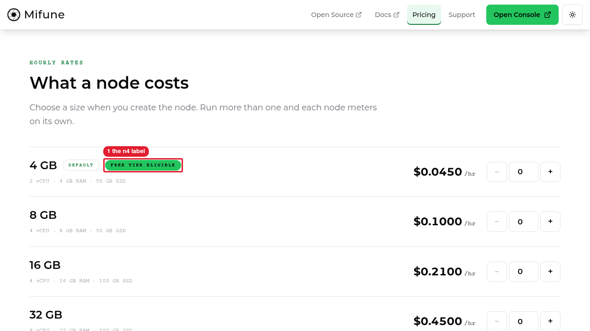 |
   | [Pricing before, mobile, full page](before/pricing-mobile-full.png) | 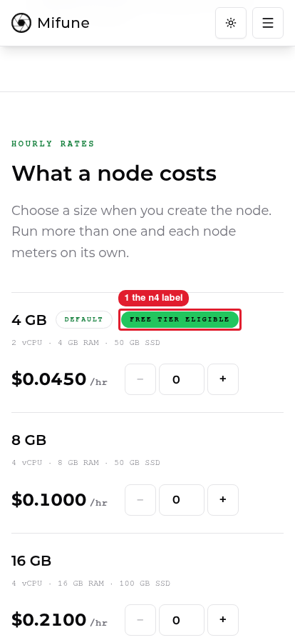 |

   Callouts: 1 is the n4 label.

## F. Pricing FAQ

1. On `/pricing`, open "Do I need a card to start?". Expected: the answer starts with "No, not for the free tier." The questions "What happens when my free hours run out?" and "Do I need an SSH key?" follow it.

   | Before | After |
   |---|---|
   | [Pricing before, desktop, full page](before/pricing-desktop-full.png) | 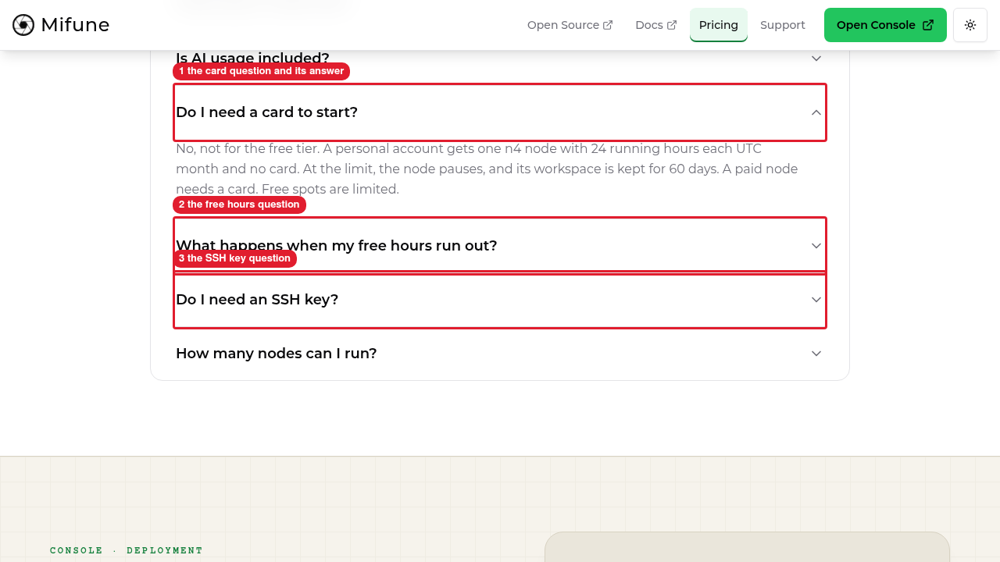 |
   | [Pricing before, mobile, full page](before/pricing-mobile-full.png) | 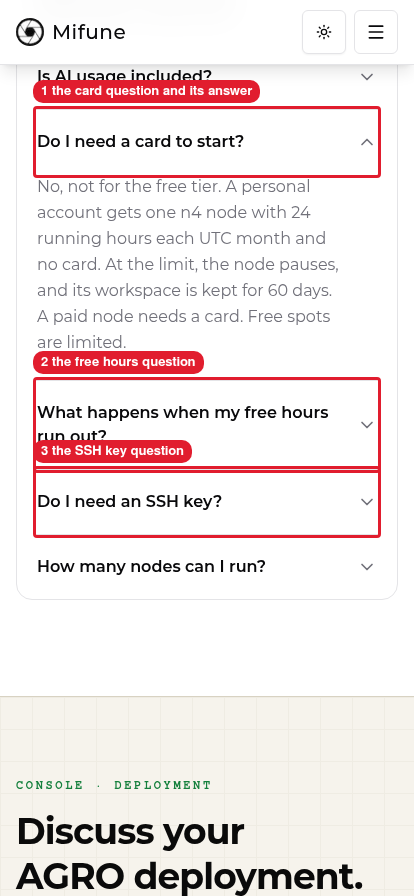 |

   Callouts: 1 is the card question and its answer. 2 is the free hours question. 3 is the SSH key question.

## Full pages after the change

- [Home after, desktop](after/home-desktop-full.png)
- [Home after, mobile](after/home-mobile-full.png)
- [Pricing after, desktop](after/pricing-desktop-full.png)
- [Pricing after, mobile](after/pricing-mobile-full.png)

## Cleanup

The run started one process, `next-server` on port 3100, and stopped it. The run created no other resource.
