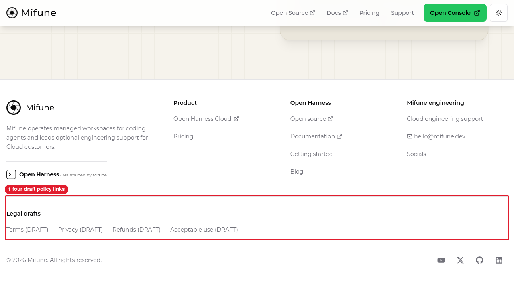
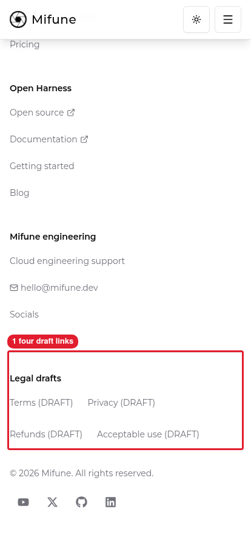

# Manual review: website draft links

## Setup

The advisor ran the focused regression tests, lint, and build in the website task worktree inside the sandbox. Every command exited 0.

The advisor started the built website at `127.0.0.1:3065` in owned Herdr pane `w1:p28`.

The companion console standalone bundle ran locally at `127.0.0.1:3055`. The review used no real account, form submission, or payment operation.

## A. Desktop footer

1. Open the local website with agent-browser at 1280 × 720.
2. Scroll to the Legal drafts navigation.
   Expected: Terms, Privacy, Refunds, and Acceptable use each display `DRAFT`.
   
   Callouts: 1 is four draft policy links.
3. Inspect the four source destinations.
   Expected: each destination uses `https://console.mifune.dev/legal/` and the corresponding policy slug.
   `canonical-destinations.json` records the unchanged production-origin destinations.

## B. Mobile footer and keyboard

1. Resize the viewport to 414 × 896 and scroll to Legal drafts.
   Expected: all four draft links remain visible and wrap onto two rows.
   
   Callouts: 1 is four draft links.
2. For local navigation only, replace the canonical origin in the browser's anchor attributes with `http://127.0.0.1:3055`.
   The source files and production URLs remain unchanged. The review did not request production pages.
3. Focus Terms, then press Tab and Enter.
   Expected: Privacy receives focus and opens the local `/legal/privacy` page with `Draft — not effective`.
   `website-keyboard.json` records the original destination and the local substitute.
4. Follow all four footer links using the same local-only substitution.
   Expected: each corresponding page displays the draft warning and unfinished effective date.
   `all-footer-links.txt` records the four website results and four console results.

## Scope limits

The browser substitution proves local navigation and preserves evidence of the source destinations. The substitution does not prove that production already serves those pages.

The change does not remove Google Analytics, submit contact data, approve final policies, or establish consent compliance.

The new PR targets the existing development integration branch. The current master deployment remains unchanged.

## Cleanup

The advisor closed the named browser sessions and owned review panes. The website review port stopped responding.

No provider node, account, or external resource required deletion.
