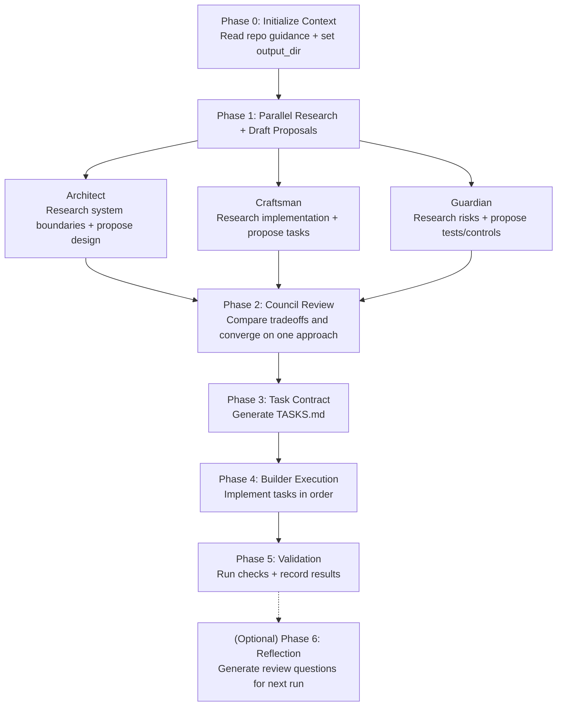

In 2026, “agentic coding” is no longer a party trick. It’s a production workflow—if (and only if) you treat it like engineering: clear contracts, tight feedback loops, and deliberate context management.

This post is a practical guide to the four tools I keep coming back to. Together they form a workflow that scales from “I have an idea” to “here’s a tested PR” without turning your codebase into AI-generated sludge.

---

## The 4 Tools (and what each is *for*)

### 1) `/team`: multi-agent analysis → one plan you’d actually execute

When I don’t know the right approach yet, I don’t want one agent guessing in a single pass. I want **multiple expert perspectives** exploring the solution space, then a synthesis that turns into an actionable plan.

That’s what our `/team` workflow is for:

- **Phase 0**: load baseline context (the repo’s guiding docs) so agents don’t reinvent conventions
- **Phase 1**: spawn a small council of specialists (architecture, craftsmanship, security/testing)
- **Phase 2**: synthesize a unified approach and resolve tradeoffs
- **Phase 3**: produce a task contract (`TASKS.md`) that is ordered, atomic, and verifiable

Here’s the simplest mental model for `/team`:

The point isn’t to “ask AI what to do.” The point is to **maximize surface area**, gather options, and then deliberately converge.

- **Reference**: `/team` command spec lives at [`.claude/commands/team.md`](https://github.com/ruska-ai/orchestra/blob/development/.claude/commands/team.md)

#### When I reach for `/team`

- New feature where there are multiple legitimate architectures
- Refactors where the blast radius isn’t obvious yet
- Anything with tricky edges (auth, streaming, state machines, permissions)

#### What `/team` produces that matters

- A shared vocabulary for the change (“here are the tradeoffs we considered”)
- A plan that can be handed to a human *or* used as the seed for an execution loop
- A clear boundary between “exploration” and “implementation”

---

### 2) `/ticket`: GitHub issue → worktree → spec artifacts → PR

Once the problem has a home (a GitHub issue), I want my workflow to stop being artisanal. The goal is to standardize all the mechanical steps so the human (and the agent) can focus on the actual work.

`/ticket` is the automation glue:

- Validate and parse the issue URL
- Pull issue metadata with `gh`
- Create a scoped worktree off `origin/development`
- Generate a changelog commit to anchor the branch
- Generate user stories with acceptance criteria
- Invoke `/team` using the issue + stories as input
- Push and open a PR with a body derived from the artifacts

If you’ve ever lost an hour to “branch naming + worktree + boilerplate PR body,” this is the fix.

- **Reference**: `/ticket` command spec lives at [`.claude/commands/ticket.md`](https://github.com/ruska-ai/orchestra/blob/development/.claude/commands/ticket.md)

#### Why this matters for agentic workflows

Agents are great at reasoning and editing. They are also great at losing the plot if you don’t give them a predictable runway.

`/ticket` gives you:

- Repeatable structure
- Repeatable artifacts
- Repeatable review surfaces

And that’s what turns “agent output” into “engineering output.”

---

### 3) Ralph: an autonomous execution loop that respects context windows

`/team` is for exploration and convergence. Ralph is for **execution, iteration, and bookkeeping**.

Ralph is an autonomous agent loop that operates on a very specific constraint: **each iteration has a limited context window**. So instead of pretending one run can do everything, Ralph works from a PRD turned into small, verifiable user stories (`prd.json`) and executes **one story per iteration**.

Key mechanics:

- **PRD → `prd.json`**: break work into stories that can finish in one run
- **One story at a time**: pick the highest priority `passes: false`
- **Quality gates**: run checks (typecheck/lint/tests) before committing
- **Progress logging**: append a progress note, and consolidate reusable patterns over time

This is how you get reliable momentum without the “context window cliff” where the agent forgets what it was doing halfway through.

- **Reference**: Ralph lives in this repo under [`/.ralph`](https://github.com/ruska-ai/orchestra/tree/development/.ralph)
- **Reference**: It’s based on the excellent starting point from [`github.com/snarktank/ralph`](https://github.com/snarktank/ralph)

#### The hidden superpower: you can make the loop observable

The workflow gets dramatically better when you can *see* each iteration. In my setup, I use a **Stop hook** that posts the iteration output to a Slack channel. That gives me a clean, scrollable audit log of:

- what the agent tried
- what changed
- what broke
- what it learned

If you’re going to rely on an agent, you want the same thing you want from any distributed system: **traces**.

---

### 4) `AGENTS.md`: keep the agent in Geoff Huntley’s “Smart Zone”

This is the unsexy one—and it’s the one that compounds.

Every serious agentic workflow eventually crashes into the same limit: **context**. Not tokens in the abstract, but *useful context*.

The trick is to keep your “always-on instructions” small, accurate, and high-signal. In this repo, that’s `AGENTS.md` (and any local `AGENTS.md` files nearer to the work). When those files are clean, the agent stays in what Geoff Huntley calls the **“Smart Zone”** of the context window: enough constraints to behave like a senior engineer, not so much noise that it misses the important parts.

In practice, `AGENTS.md` should contain:

- how the project is structured
- how to run tests / formatters
- conventions that are easy to miss
- “when you touch X, don’t forget Y” gotchas
- security do’s and don’ts

And it should *not* contain:

- long narratives
- outdated instructions
- one-off story notes

- **Reference**: see [`/AGENTS.md`](https://github.com/ruska-ai/orchestra/blob/development/AGENTS.md)

---

## The workflow: from idea → plan → PR (without chaos)

Here’s the loop as I actually run it:

1. **Explore and converge** with `/team` until the approach feels “boring”
2. Decide the execution mode:
   - **Small change**: implement directly with your agent in the IDE
   - **Ticketed work**: run `/ticket` so you get worktree + artifacts + PR scaffolding
   - **Multi-iteration work**: convert the plan into Ralph-sized stories and run the loop
3. Keep context “sharp”:
   - prune and update `AGENTS.md` when you learn something reusable
   - keep acceptance criteria verifiable and binary
   - make the workflow observable (logs, hooks, CI gates)
4. *(Optional)* **Reflect and generate review questions**:
   - I often ask Claude Code to reflect on the latest run (what worked, what broke, what was confusing)
   - then have it generate a short set of **multiple-choice questions** that I (or the next agent run) can answer to tighten the next iteration

The goal isn’t “AI writes the code.” The goal is **a system that reliably turns intent into validated changes**.

---

## How to get better results (fast)

If you want to copy this workflow, here are the two highest-leverage habits:

### Habit 1: Treat plans like contracts

The moment your “plan” becomes a checklist with acceptance criteria, you can:

- delegate safely
- review quickly
- recover from failures without re-explaining everything

This is why `/team` ends in a task contract, and why Ralph runs one story at a time.

### Habit 2: Design your context window on purpose

Most agent failures aren’t “the model is bad.” They’re:

- the repo is undocumented
- instructions are stale
- acceptance criteria are vague
- the agent is asked to do too much in one run

Fix those, and your success rate spikes.

---

## Closing thought

Agentic coding in 2026 is about **workflow design**, not model worship. The models will keep changing. The habits that ship—contracts, observability, and clean context—stay useful.

If you want to see how we’re building these workflows in the open, check out [Orchestra on GitHub](https://github.com/ruska-ai/orchestra).

---

## References

- `/team`: [`.claude/commands/team.md`](https://github.com/ruska-ai/orchestra/blob/development/.claude/commands/team.md)
- `/ticket`: [`.claude/commands/ticket.md`](https://github.com/ruska-ai/orchestra/blob/development/.claude/commands/ticket.md)
- Context hygiene: [`AGENTS.md`](https://github.com/ruska-ai/orchestra/blob/development/AGENTS.md)
- Ralph baseline: [`github.com/snarktank/ralph`](https://github.com/snarktank/ralph)

